# Sora Auto Submit

Automated queue management for OpenAI Sora video generation. This script connects to Arc browser via Chrome DevTools Protocol (CDP) and automatically submits prompts to maintain a queue of up to 3 concurrent video generations.

## Prerequisites

- **Arc Browser** installed on macOS
- **Node.js** (v16 or higher)
- **Sora account** - You must be logged in to Sora in Arc
- **npm** package manager

## Installation

1. Clone or download this repository
2. Install dependencies:
   ```bash
   npm install
   ```

## Configuration

1. **Configure Arc Browser for Remote Debugging**

   Quit Arc if it's running, then launch it with remote debugging enabled:
   ```bash
   /Applications/Arc.app/Contents/MacOS/Arc --remote-debugging-port=9222 --profile-directory=Market
   ```
   
   Replace `Market` with your actual Arc profile directory name if different.

2. **Open Sora in Arc**

   - Navigate to `https://sora.chatgpt.com/drafts` (or the main Sora page)
   - Ensure you're logged in and the page is fully loaded

3. **Configure Settings (Optional)**

   Edit `config.json` to customize:
   - `MAX_CONCURRENT`: Number of concurrent generations (default: 3, max: 3)
   - `PROMPT_FILE_RUNS`: How many times to cycle through prompts (default: 1, null = infinite)
   - `SORA_UI_MODE`: UI detection mode - "auto", "old", or "new" (default: "new")
   - `SORA_MODE`: "Video" or "Image"
   - `SORA_ASPECT`: Aspect ratio (e.g., "9:16", "16:9")
   - `SORA_DURATION`: Video duration (e.g., "10s", "15s")
   - And many other timing/selector configurations

4. **Prepare Prompts**

   Edit `prompts.json` with your prompts. The file can contain:
   - An array of strings (simple prompts)
   - An array of objects (structured prompts)
   - A single string or object

   Example:
   ```json
   [
     "A cinematic shot of a sunset over mountains",
     "A futuristic cityscape at night with neon lights"
   ]
   ```

## Starting the Script

1. **Ensure Arc is running with remote debugging** (see Configuration step 1)
2. **Ensure Sora is open and logged in** in Arc
3. **Run the script**:
   ```bash
   npm run queue
   ```
   
   Or directly:
   ```bash
   node sora_queue.js
   ```

## How It Works

The script operates in the following stages:

### 1. **Connection Phase**
- Connects to Arc browser via CDP at `http://localhost:9222`
- Locates the Sora page/tab in Arc
- Detects which Sora UI mode is active (old activity counter or new drafts-based UI)

### 2. **Pre-Flight Tests**
Before starting submissions, the script runs comprehensive tests:
- ✅ CDP connection verification
- ✅ Sora page accessibility
- ✅ In-progress detection mechanism
- ✅ Prompt textarea availability
- ✅ Submit button detection
- ✅ Prompts file loading
- ✅ Log file writability

If any test fails, the script exits with an error message.

### 3. **Main Loop**
The script continuously monitors and submits:

1. **Check Rate Limits**: If a 429 (rate limit) response was received, wait for the backoff period
2. **Check Capacity**: Count current in-progress generations
   - **Old UI**: Reads from activity counter (e.g., "2/3")
   - **New UI**: Counts spinner overlays on draft tiles
3. **Check Timing**: Ensures minimum interval between submissions
4. **Submit Prompt**: If capacity available:
   - Loads next prompt from `prompts.json`
   - Fills the prompt textarea
   - Applies video settings (aspect ratio, duration, orientation, etc.)
   - Clicks submit button
   - Verifies submission by monitoring network requests
5. **Track Progress**: Updates counters and cycles through prompts
6. **Exit Condition**: Stops when `PROMPT_FILE_RUNS` is reached (if set)

### 4. **Submission Process**

For each prompt submission:
- Focuses and activates the Sora page
- Clears and fills the prompt textarea
- Applies UI mode-specific settings:
  - **Old UI**: Clicks mode/aspect/resolution/duration buttons
  - **New UI**: Opens settings menu and selects orientation/duration
- Attempts multiple click strategies (normal → force → JavaScript)
- Monitors for generation API request/response
- Waits for UI to update before next check

### 5. **Error Handling**

- **Rate Limiting**: Automatically backs off on 429 responses
- **Network Errors**: Logs and retries with exponential backoff
- **UI Changes**: Supports both old and new Sora UI modes
- **Selector Failures**: Falls back to alternative selectors

## Workflow Diagram

```mermaid
flowchart TD
    Start([Start Script]) --> Connect[Connect to Arc via CDP<br/>localhost:9222]
    Connect --> FindPage[Find Sora Page in Browser]
    FindPage --> DetectUI[Detect UI Mode<br/>Old/New/Auto]
    DetectUI --> Preflight[Run Pre-Flight Tests]
    
    Preflight --> TestCDP{CDP<br/>Connected?}
    TestCDP -->|No| Exit1([Exit: Connection Failed])
    TestCDP -->|Yes| TestPage{Sora Page<br/>Found?}
    
    TestPage -->|No| Exit2([Exit: Page Not Found])
    TestPage -->|Yes| TestUI{UI Detection<br/>Works?}
    
    TestUI -->|No| Exit3([Exit: UI Detection Failed])
    TestUI -->|Yes| TestPrompt{Prompt<br/>Textarea<br/>Found?}
    
    TestPrompt -->|No| Exit4([Exit: Textarea Not Found])
    TestPrompt -->|Yes| TestSubmit{Submit<br/>Button<br/>Found?}
    
    TestSubmit -->|No| Exit5([Exit: Submit Button Not Found])
    TestSubmit -->|Yes| LoadPrompts[Load Prompts from<br/>prompts.json]
    
    LoadPrompts --> MainLoop[Main Submission Loop]
    
    MainLoop --> CheckBackoff{Rate Limit<br/>Backoff<br/>Active?}
    CheckBackoff -->|Yes| WaitBackoff[Wait for Backoff<br/>Period]
    WaitBackoff --> MainLoop
    
    CheckBackoff -->|No| CheckInterval{Min Interval<br/>Elapsed?}
    CheckInterval -->|No| WaitInterval[Wait for Interval]
    WaitInterval --> MainLoop
    
    CheckInterval -->|Yes| CheckCapacity[Read In-Progress Count]
    CheckCapacity --> CountCheck{Count Less Than<br/>MAX_CONCURRENT?}
    
    CountCheck -->|No| WaitCapacity[Wait: At Capacity]
    WaitCapacity --> MainLoop
    
    CountCheck -->|Yes| CheckRuns{PROMPT_FILE_RUNS<br/>Reached?}
    CheckRuns -->|Yes| Exit6([Exit: Completed All Runs])
    
    CheckRuns -->|No| GetPrompt[Get Next Prompt<br/>from Queue]
    GetPrompt --> FillPrompt[Fill Prompt Textarea]
    FillPrompt --> ApplySettings[Apply Video Settings<br/>Aspect/Duration/Orientation]
    ApplySettings --> ClickSubmit[Click Submit Button<br/>Multiple Strategies]
    ClickSubmit --> MonitorRequest[Monitor Generation<br/>API Request]
    MonitorRequest --> CheckResponse{Request<br/>Successful?}
    
    CheckResponse -->|No| LogFail[Log Failure]
    LogFail --> WaitRetry[Wait Before Retry]
    WaitRetry --> MainLoop
    
    CheckResponse -->|Yes| UpdateCounters[Update Submission<br/>Counters]
    UpdateCounters --> NextPrompt[Move to Next Prompt]
    NextPrompt --> CheckCycle{Completed<br/>Full Cycle?}
    
    CheckCycle -->|Yes| IncrementCycle[Increment Cycle Counter]
    IncrementCycle --> CheckFinal{Reached<br/>PROMPT_FILE_RUNS?}
    CheckFinal -->|Yes| Exit6
    CheckFinal -->|No| MainLoop
    
    CheckCycle -->|No| WaitSubmit[Wait After Submit]
    WaitSubmit --> MainLoop
    
    style Start fill:#90EE90
    style Exit1 fill:#FFB6C1
    style Exit2 fill:#FFB6C1
    style Exit3 fill:#FFB6C1
    style Exit4 fill:#FFB6C1
    style Exit5 fill:#FFB6C1
    style Exit6 fill:#90EE90
    style MainLoop fill:#87CEEB
    style Preflight fill:#FFD700
```



## Features

- ✅ **Automatic Queue Management**: Maintains up to 3 concurrent generations
- ✅ **Dual UI Support**: Works with both old and new Sora interfaces
- ✅ **Smart Detection**: Auto-detects UI mode or can be manually configured
- ✅ **Rate Limit Handling**: Automatically backs off on 429 responses
- ✅ **Pre-Flight Testing**: Validates setup before starting submissions
- ✅ **Progress Tracking**: Shows progress bar and detailed status logs
- ✅ **Hot Reload**: Automatically reloads prompts.json if file changes
- ✅ **Comprehensive Logging**: Writes detailed logs to `sora.log` (if configured)
- ✅ **Flexible Configuration**: Extensive config options via `config.json` or environment variables

## Troubleshooting

### Script can't connect to Arc
- Ensure Arc is launched with `--remote-debugging-port=9222`
- Check that no other process is using port 9222
- Verify the profile directory name matches your Arc profile

### Pre-flight tests fail
- Ensure Sora page is fully loaded in Arc
- Check that you're logged in to Sora
- Verify CSS selectors in `config.json` match current Sora UI

### Submissions not working
- Check browser console for errors
- Verify prompt textarea and submit button selectors
- Ensure minimum interval between submissions is respected
- Check for rate limiting (429 responses)

### UI detection issues
- Set `SORA_UI_MODE` explicitly in `config.json` ("old" or "new")
- For new UI, ensure you're on the drafts page
- Update selectors in `config.json` if Sora UI changed

## Configuration Reference

Key configuration options in `config.json`:

| Option | Description | Default |
|--------|-------------|---------|
| `MAX_CONCURRENT` | Max concurrent generations (1-3) | 3 |
| `PROMPT_FILE_RUNS` | Number of times to cycle prompts (null = infinite) | 1 |
| `SORA_UI_MODE` | UI mode: "auto", "old", or "new" | "new" |
| `POLL_MS` | Polling interval when at capacity (ms) | 5000 |
| `MIN_SUBMIT_INTERVAL_MS` | Minimum time between submissions (ms) | 12000 |
| `BACKOFF_429_MS` | Backoff time after rate limit (ms) | 60000 |
| `LOG_FILE` | Path to log file (null = no logging) | "sora.log" |

See `config.json` for the complete list of configurable options.

## License

Private project - All rights reserved

